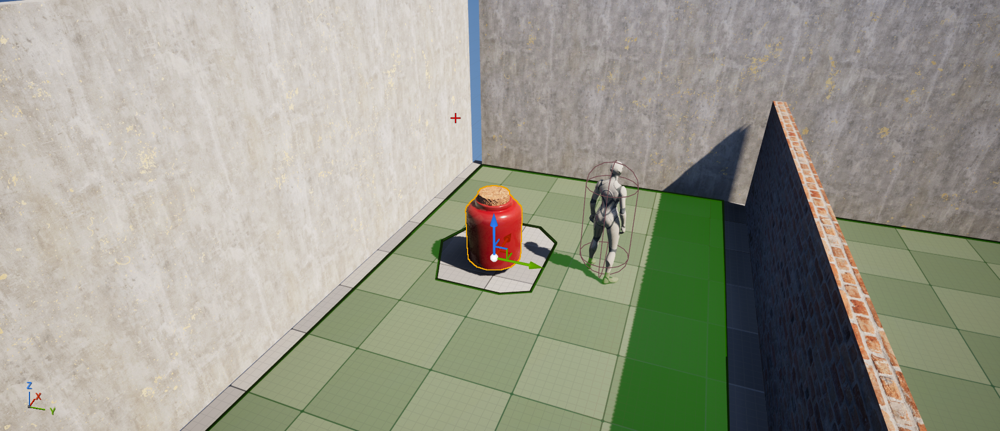
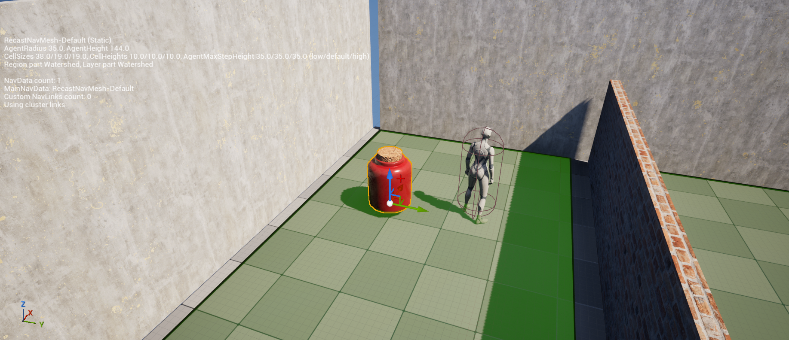

# [ Color Defense ]
- 1~7 빨주노초파남보 890 툴
- 파초노주빨 순으로 체력 여러 개인 옵젝 / 빨강으로 갈 수록 크기가 미미하게 작아짐
- 시작 메뉴판 : 설정을 다 지워야 시작 / 게임 컨셉 자연스럽게 학습
- 대쉬, 점프

## 크립 이동

NavMesh

<ul>
  <li>navigation mesh</li>
  <li>삼각형은 유일한 평면을 결정하기 때문에 NavMesh에서 폴리곤으로 삼각형 사용</li>
  <li>PlaceActors / NavMeshBoundsVolume 으로 NavMesh 자동 생성</li>
  <li>P로 자동생성된 NavMesh를 볼 수 있음</li>
  <li>NavMeshBoundsVolume 설치 시 RecastNavMesh-Default actor 자동 생성</li>
  <li>RecastNavMesh-Default / Details / Display / Draw Offset 으로 경사면에서의 NavMesh 생성 조절</li>
</ul>

  
 Ai Move To 노드에 Pawn을 연결하니 움직이지 않음 

  

    
    
  

  <ul>
    <li>https://dev.epicgames.com/documentation/en-us/unreal-engine/basic-navigation-in-unreal-engine</li>
    <li>위 링크대로 BP_ThirdPersonCharacter를 AI Move To 노드로 움직일 땐 잘 됨</li>
    <li>BP_APawnCreep으로 따라해보니 움직이지 않음</li>
    <li>SM_Jar_01 / Details / Navigation / Advanced / Can Ever Affect Navigation 비활성화</li>
    <li>floating Movement Component 추가</li>
    <li>보통 SM 들은 저 옵션이 활성화 되어 있어서 NavMesh가 생성될 때 경로에서 제외되어 폰이 갇힌 상태가 되므로 움직일 수 없음</li>
  </ul>

  
 Creep이 Waypoint의 정중앙을 지나지 않는 문제 

  <ul>
    <li>AIConotroller의 MoveToLocation은 도착 기준을 Actor의 정중앙이 아니라 collsion capsule을 기준으로 함</li>
    <li>그래서 StaticMesh의 표면이 조금만 도착해도 도착했다고 판정</li>
    <li>StaticMesh의 collsion을 없애면 될 듯?</li>
  </ul>

reference

https://dev.epicgames.com/documentation/en-us/unreal-engine/basic-navigation-in-unreal-engine

