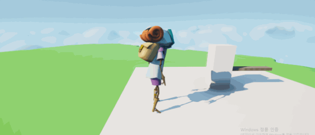

# 장애물 달리기 (Obstacle Assault)
- 폴가이즈 같은 장애물 달리기 게임을 만들어보자

## 움직이는 플랫폼
- cpp Tick() 사용
- SetActorLocation, GetActorLocation에 FVector 전달
- DeltaTime으로 프레임률 차이 극복 + 플랫폼의 속력 구현

## 앞뒤로 움직이는 플랫폼
- FVector::Dist, if 사용
- 시작점에서 100cm 좌우 반복 운동

