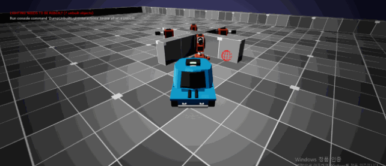
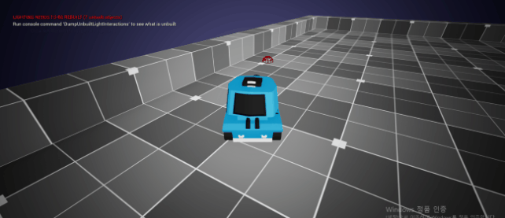
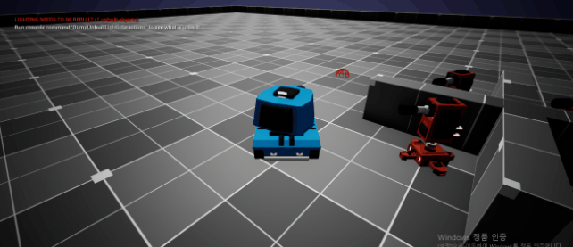
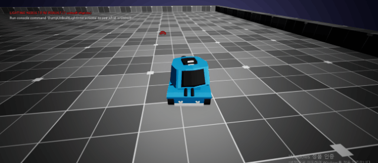

# 툰탱크

## WASD 이동
- WASD로 탱크 이동
- 마우스 커서 방향으로 탱크 터렛 회전
  

## 회전 보간 및 블로킹 볼륨 설치
- 탱크 터렛의 회전을 보간하여 부드럽게 회전하도록 만듦
- 맵 사방면에 블로킹 볼륨 설치하여 맵 밖으로 라인 트레이스하지 않도록 설정
- 

## 타워 회전
- 사정 범위 내 탱크 접근 시 탱크가 있는 방향으로 타워의 터렛 회전
  

## Fire 디버깅
- Fire 함수 Tank에 우선 적용
- DebugSphere 사용하여 시각화

  
